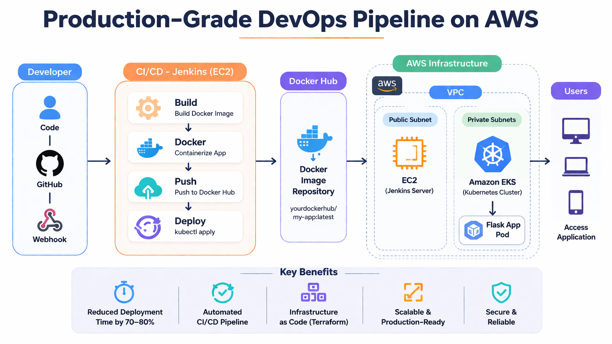
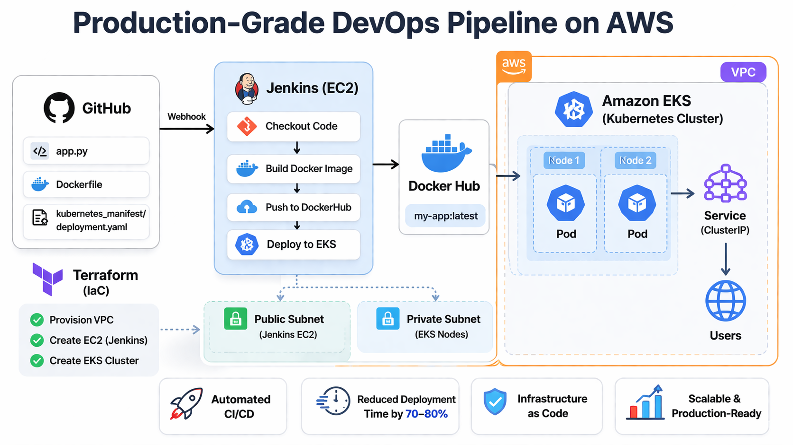

# 🚀 Production-Grade DevOps Pipeline on AWS

A complete end-to-end DevOps project demonstrating infrastructure provisioning, CI/CD automation, containerization, and Kubernetes deployment on AWS.

This project is designed to showcase **real-world DevOps practices** using Terraform, Jenkins, Docker, and Amazon EKS.

---

# 📌 Project Overview

This project automates the full lifecycle of an application:

* Infrastructure provisioning using **Terraform**
* Application containerization using **Docker**
* CI/CD pipeline using **Jenkins**
* Deployment on **Kubernetes (Amazon EKS)**

---

# 🏗️ Architecture

### Flow:

User → Load Balancer → Kubernetes (EKS) → Docker Containers
↑
Jenkins CI/CD
↑
GitHub Repo
↑
Terraform (Infrastructure)

---

## 🏗️ Architecture Diagram



# 📁 Project Structure

```
Production-Grade-DevOps-Pipeline-on-AWS/
│
├── application code/
│   └── app.py
│
├── docker_image/
│   └── Dockerfile
│
├── cicd/
│   └── Jenkinsfile
│
├── kubernetes_manifest/
│   └── deployment.yaml
│
├── terraform/
│   ├── main.tf
│   ├── variables.tf
│   ├── outputs.tf
│   ├── provider.tf
│   └── modules/
│       ├── vpc/
│       ├── ec2/
│       └── eks/
│
└── README.md
```

---

# ⚙️ Tech Stack

* **Cloud:** AWS (VPC, EC2, IAM, EKS)
* **Infrastructure as Code:** Terraform
* **CI/CD:** Jenkins
* **Containerization:** Docker
* **Orchestration:** Kubernetes (EKS)
* **Monitoring (Optional):** Prometheus, Grafana
* **Language:** Python (Flask)

---

# 🚀 Setup Instructions

## 1️⃣ Prerequisites

Make sure you have:

* AWS CLI configured
* Terraform installed
* Docker installed
* kubectl installed
* Jenkins installed

---

## 2️⃣ Infrastructure Setup (Terraform)

```
cd terraform
terraform init
terraform plan
terraform apply
```

---

## 3️⃣ Configure EKS Access

```
aws eks update-kubeconfig --region ap-south-1 --name bablu-eks
```

---

## 4️⃣ Setup Jenkins

* Install Docker & kubectl on Jenkins server
* Add DockerHub credentials in Jenkins
* Create a pipeline job
* Point to your Jenkinsfile

---

## 5️⃣ Run CI/CD Pipeline

Pipeline will:

1. Build Docker image
2. Push image to DockerHub
3. Deploy application to Kubernetes

---

# 🐳 Docker (Manual Test)

```
docker build -t yourdockerhubusername/my-app .
docker push yourdockerhubusername/my-app
```

---

# ☸️ Kubernetes Deployment

```
kubectl apply -f kubernetes_manifest/deployment.yaml
```

---

# 📊 Outputs

After Terraform execution, you will get:

* Jenkins Public IP
* EKS Cluster Name
* EKS Endpoint

---

## 📈 Impact

Reduced application deployment time by **70–80%** by implementing an automated CI/CD pipeline using Jenkins, Docker, and Kubernetes, eliminating manual deployment steps and improving release consistency.

# 🎯 Key Features

* Modular Terraform architecture
* Production-style CI/CD pipeline
* Kubernetes-based deployment
* Infrastructure as Code (IaC)
* Scalable and reusable design

---

# 🧠 What I Learned

* Designing VPC and networking for EKS
* Writing reusable Terraform modules
* Building CI/CD pipelines with Jenkins
* Deploying applications on Kubernetes
* Managing containerized workloads

---

# ⚠️ Important Notes

* EKS resources may incur AWS charges
* Always destroy resources after testing

```
terraform destroy
```

---

# 👨‍💻 Author

**Bablu Alam**
Cloud / DevOps Engineer

* LinkedIn: https://www.linkedin.com/in/bablu-alam/
* GitHub: https://github.com/skbablualam

---

# ⭐ Support

If you found this project useful, consider giving it a ⭐ on GitHub!